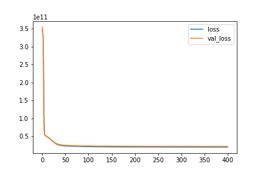

### [LinkedIn](https://www.linkedin.com/in/ahnngo/) - Email: ngoa@berea.edu - Berea College, KY 40404
*A passionate Data Science student. Proficient in Python (NumPy, Pandas, Matplotlib, Seaborn, Sklearn, TensorFlow, Tensorboard, Spark, etc), and SQL. Comfortable with Machine Learning. Mathematically amazing and familiar with Economics concepts. Actively looking for internship opportunities.*

# Project 1: [Cervical Cancer Detection Web App](https://github.com/ahnngo/cervical-cancer-project)
* Lead a team of 3 to work on student-oriented, independent Cervical Cancer research utilizing Machine Learning, sponsored by Berea College CS and Chemistry professors
* Build and maintain a [cervical tracking web app](https://ahnngo-cervical-cancer-project-modelsapp-g6re8j.streamlitapp.com/) using Streamlit package, with 200+ users over the first one week
* Implemented Feature Selection successfully to reduce from 32 features to 8 features with SVM Classification, yielding an accuracy of 98.18%, achieving higher cancer detection reliability compared to previous findings 
* Boosted the precision from 0% to 99% by computing proficient resampling Borderline-SMOTE method

|    Test    |                        Model                        | No of Features | Accuracy | Precision | Sensitivity | Specificity |   F-1  |
|------------|:---------------------------------------------------:|:--------------:|:--------:|:---------:|:-----------:|:-----------:|:------:|
| Hinselmann |      SVM      + Borderline-SMOTE + Meta-transformer |        8       |  98.18%  |   98.76%  |    97.55%   |    98.80%   | 98.15% |
|  Schiller  | Random Forest + Borderline-SMOTE + Meta-transformer |        7       |  96.17%  |   96.58%  |    95.27%   |    96.97%   | 95.92% |
|  Citology  |      SVM      + Borderline-SMOTE + Meta-transformer |        6       |  97.54%  |   97.65%  |    97.65%   |    97.42%   | 96.74% |
|   Biopsy   | Random Forest + Borderline-SMOTE + Meta-transformer |        8       |  96.57%  |  100.00%  |    93.13%   |   100.00%   | 96.44% |

# Project 2: [Clustering and Predicting Credit Approval](https://github.com/ahnngo/Credit-Approval-Clustering-and-Predicting/tree/master)
* Created a model to divide all customer data points into 3 clusters by comparing yielded results from the Elbow and the Average Silhouette method
* Achived an accuracy score of 0.82 for predicting credit approval by performing suitable feature engineer such as eliminating outliers and deploying neural network classification, helping banks making better decisions related to customers payment and borrowing

# Project 3: [Predict Students' Dropout and Academic Success](https://github.com/ahnngo/Predict-students-dropout-and-academic-success)
* Created a tool to estimate the risk of dropout and failure based on academic path, demographics, and social-economic factors, helping to provide more accurate help to students by deploying multiple machine learning classification methods and deep learning
* Increased the accuracy from 0.78 (Random Forest Algorithm) to 0.92 by implementing efficient feature engineer (eliminating outliers and deleting repeating features) and deploying Deep Learning with the support of Dropout and EarlyStopping
* Generated a Tensorboard visualization tool to facilitate the model evaluation process

# Project 4: [Predicting House Prices in King County, USA](https://github.com/ahnngo/Predicting-House-Prices-in-King-County-USA)
* Created a model that estimates housing price (Variance Score = 0.8) to help predict housing prices in King County based on house's features
* Implemented Feature Engineer to punish outliers, decreasing MSE by $20k and MAE by $3k using a deep learning model
* Improved Variance Score by 0.1, from 0.7 (Linear Regression model) to 0.8 by deploying a neural network with two hidden layers

# Project 5: [Impacts of the COVID Pandemic on the 15 largest American banks](https://github.com/ahnngo/bank-stocks-affected-by-covid)
* Built data frames demonstrating stock prices of largest banks in the USA from 2019-01-01 to 2022-03-14 by reading data from Yahoo finance and HTML dataset from bankrate.com for stock prices of largest banks in the USA
* Utilized Matplotlib and Seaborn effectively to demonstrate the stock prices fluctuations during the timeframe and what dates each bank stock had the best and worst single-day returns
* Compared the impacts of the COVID pandemic versus the 2007-2009 Great Recession on bank stocks using appropriate plotting and scattering methods

# Project 5: [Analyzing Vietnamese Graduation Score](https://github.com/ahnngo/analyzing_vietnamese_graduation_score_2020)
* Exploited Python to curl and clean data of 74000 + candidates, including full names, DOB, and scores for 11 exams
* Utilized rigorously NumPy and Pandas to create 5+ DataFrames for plotting
* Utilized Matplotlib, Seaborn, and Pandas built-in visualization tools flexibly draw 10+ charts for testing null hypothesis
* Created a database in pgAdmin and extracted output using SQL queries to assess the coding part's accuracy and efficiency and detect errors in the dataset

